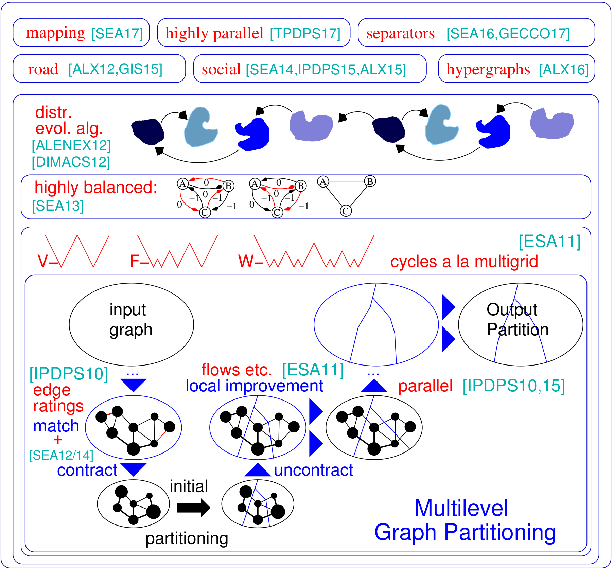

KaHIP v3.15  [](https://www.codacy.com/gh/KaHIP/KaHIP/dashboard?utm_source=github.com&amp;utm_medium=referral&amp;utm_content=KaHIP/KaHIP&amp;utm_campaign=Badge_Grade)
[](https://opensource.org/licenses/MIT)
=====

The graph partitioning framework KaHIP -- Karlsruhe High Quality Partitioning.

The graph partitioning problem asks for a division of a graph's node set into k equally sized blocks such that the number of edges that run between the blocks is minimized. KaHIP is a family of graph partitioning programs. It includes KaFFPa (Karlsruhe Fast Flow Partitioner), which is a multilevel graph partitioning algorithm, in its variants Strong, Eco and Fast, KaFFPaE (KaFFPaEvolutionary) which is a parallel evolutionary algorithm that uses KaFFPa to provide combine and mutation operations, as well as KaBaPE which extends the evolutionary algorithm. Moreover, specialized techniques are included to partition road networks (Buffoon), to output a vertex separator from a given partition as well as techniques geared towards the efficient partitioning of social networks. Here is an overview of our framework:

<p align="center">

</p>


## NEW in v3.14:
**Support for Python**: KaHIP can now also be used in Python. See below how to do that.

*Node Ordering Algorithms*: Many applications rely on time-intensive matrix operations, such as factorization, which can be sped up significantly for large sparse matrices by interpreting the matrix as a sparse graph and computing a node ordering that minimizes the so-called fill-in. Here, we added new algorithms to compute fill-in reduced orderings in graphs.

*ILPs For Even Higher Quality*: ILPs typically don't scale to large instances. We adapt them to heuristically improve a given partition.  We do so by defining a much smaller model that allows us to use symmetry breaking and other techniques that make the approach scalable. We include ILPs that can be used as a post-processing step to improve high-quality partitions even further. The codes are now included in KaHIP.

*TCMalloc:* we added the possibility to link against TCMalloc. Depending on your system, this can yield an overall faster algorithm since it provides faster malloc operations.

*Faster IO*: we added an option to  kaffpa (option --mmap_io) that speedsup the IO of text files significantly -- sometimes by an order of magnitude.

*Added Support for Vertex and Edge Weights in ParHIP*: we extended the IO functionality of ParHIP to read weighted graphs in the METIS format.

*Global Multisection Mapping*: we added global multisection n-to-1 process mapping algorithms. This compute better process mapping for parallel applications if information about the system hierarchy/architecture is known.

*Determinism in ParHIP*: we added an option to run ParHIP deterministically, i.e. two runs of ParHIP using the same seed will always return the same result.

*Version Flag*: we added an option to output the version that you are currently using, use the --version option of the programs.

## NEW in v2.10: 
*ParHIP (Parallel High Quality Partitioning):* Our distributed memory parallel partitioning techniques designed to partition hierarchically structured networks such as web graphs or social networks.

*Mapping Algorithms:* Our new algorithms to map the blocks onto processors to minimize overall communication time based on hierarchical partitionings of the task graph and fast local search algorithms.

*Edge Partitioning Algorithms:* Our new algorithms to compute edge partitionings of graphs. 


## Main project site:
https://kahip.github.io

Installation Notes
=====
## Downloading KaHIP: 
You can download KaHIP with the following command line:

```console
git clone https://github.com/KaHIP/KaHIP
```

## Compiling KaHIP: 
Before you can start you need to install the following software packages:

- if you want to use parallel algorithms contained withing the framework (e.g. ParHIP) you need OpenMPI (https://www.open-mpi.org/). If you don't want to run ParHIP, you can easily get rid of this dependency.

Once you installed the packages, just type 
```console
./compile_withcmake.sh 
```
In this case, all binaries, libraries and headers are in the folder ./deploy/ 

Note that this script detects the amount of available cores on your machine and uses all of them for the compilation process. If you don't want that, set the variable NCORES to the number of cores that you would like to use for compilation. 

Alternatively use the standard cmake build process:
```console 
mkdir build
cd build 
cmake ../ -DCMAKE_BUILD_TYPE=Release     
make 
cd ..
```
In this case, the binaries, libraries and headers are in the folder ./build as well as ./build/parallel/parallel_src/

We also provide the option to link against TCMalloc. If you have it installed, run cmake with the additional option -DUSE_TCMALLOC=On. 

By default node ordering programs are also compiled. If you have Metis installed, the build script also compiles a faster node ordering program that uses reductions bevor calling Metis ND.

If you use the option -DUSE_ILP=On and you have Gurobi installed, the build script compiles the ILP programs to improve a given partition *ilp_improve* and an exact solver *ilp_exact*. Alternatively, you can also pass these options to ./compile_withmake.sh for example:

```console 
./compile_withcmake -DUSE_ILP=On
```
We also provide an option to support 64 bit edges. In order to use this, compile KaHIP with the option -D64BITMODE=On.


Lastly, we provide an option for determinism in ParHIP, e.g. two runs with the same seed will give you the same result. Note however that this option can reduce the quality of partitions, as initial partitioning algorithms do not use sophisticated memetic algorithms, but only multilevel algorithms to compute initial partitionings. ONLY use this option if you use ParHIP as a tool. Do not use this option if you want to make quality comparisons against ParHIP. To make use of this option, run 
```console 
./compile_withcmake -DDETERMINISTIC_PARHIP=On
```

Running Programs
=====

For a description of the graph format (and an extensive description of all other programs) please have a look into the manual. We give a short examples here.

## Overview of Programs and Usecase

### Default Partitioning Problem  
These programs and configurations take a graph and partition it more or less sequentially. We list here kaffpa and kaffpaE (the evolutionary framework) and their configurations. In general, the configurations are such that you can invest a lot of time into solution quality using the memetic algorithm. The memetic algorithm can also be run in parallel using MPI. In general, the more time and ressources you invest, the better will be the quality of your partition. We have a lot of trade-offs, contact us if you are unsure what works best for your application. For a description of the algorithm have a look at the references that we list in the manual.

| Use Case | Input |  Programs |
| ------------ | -------- | -------- |
| Graph Format || graph_checker  |
| Evaluate Partitions || evaluator |
| Fast Partitioning | Meshes | kaffpa preconfiguration set to fast  |
| Good Partitioning | Meshes | kaffpa preconfiguration set to eco  |
| Very Good Partitioning | Meshes | kaffpa preconfiguration set to strong |
| Highest Quality | Meshes | kaffpaE, use mpirun, large time limit  |
| Fast Partitioning | Social | kaffpa preconfiguration set to fsocial  |
| Good Partitioning | Social  | kaffpa preconfiguration set to esocial  |
| Very Good Partitioning | Social | kaffpa preconfiguration set to ssocial |
| Highest Quality | Social | kaffpaE, use mpirun, large time limit, preconfiguration ssocial  |
| Even Higher Quality || kaffpaE, use mpirun, large time limit, use the options --mh_enable_tabu_search, --mh_enable_kabapE  |
#### Example Runs
```console
./deploy/graph_checker ./examples/rgg_n_2_15_s0.graph 
```

```console
./deploy/kaffpa ./examples/rgg_n_2_15_s0.graph --k 4  --preconfiguration=strong
```

```console
mpirun -n 24 ./deploy/kaffpaE ./examples/rgg_n_2_15_s0.graph --k 4  --time_limit=3600 --mh_enable_tabu_search --mh_enable_kabapE 
```


### Distributed Memory Parallel Partitioning 
A large part of the project are distributed memory parallel algorithms designed for networks having a hierarchical
cluster structure such as web graphs or social networks. Unfortunately, previous parallel graph partitioners originally developed for more regular mesh-like networks do not work well for complex networks. Here we address this
problem by parallelizing and adapting the label propagation technique originally developed for graph clustering.
By introducing size constraints, label propagation becomes applicable for both the coarsening and the refinement
phase of multilevel graph partitioning. This way we exploit the hierarchical cluster structure present in many complex networks. We obtain very high quality by applying a highly parallel evolutionary algorithm to the coarsest
graph. The resulting system is both more scalable and achieves higher quality than state-of-the-art systems like
ParMetis or PT-Scotch.

Our distributed memory parallel algorithm can read binary files as well as standard Metis graph format files. Binary files are in general much more scalable than reading text files in parallel applications. The way to go here is to convert the Metis file into a binary file first (ending .bgf) and then load this one.

| Use Case | Programs |
| ------------ | -------- |
| Parallel Partitioning | parhip, graph2binary, graph2binary_external, toolbox |
| Distributed Memory Parallel, Mesh | parhip with preconfigs ecomesh, fastmesh, ultrafastmesh |
| Distributed Memory Parallel, Social | parhip with preconfigs ecosocial, fastsocial, ultrafastsocial |
| Convert Metis to Binary | graph2binary, graph2binary_external |
| Evaluate and Convert Partitions | toolbox |

#### Example Runs
```console
./deploy/graph2binary examples/rgg_n_2_15_s0.graph examples/rgg_n_2_15_s0.bgf
```

```console
mpirun -n 24 ./deploy/parhip ./examples/rgg_n_2_15_s0.graph --k 4 --preconfiguration=fastmesh
```

```console
mpirun -n 24 ./deploy/parhip ./examples/rgg_n_2_15_s0.bgf --k 4 --preconfiguration=fastmesh
```

### Node Separators 

The node separator problem asks to partition the node set of a graph into three sets A, B and S such that the
removal of S disconnects A and B. We use flow-based and localized local search algorithms withing a multilevel
framework to compute node separators.
KaHIP can also compute node separators. In can do so with a standard node separator (2-way), but it can also compute k-way node separators.

| Use Case | Programs |
| ------------ | -------- |
| 2-Way Separators | node_separator |
| KWay Separators | use kaffpa to create k-partition, then partition_to_vertex_separator to create a separator |

#### Example Runs
```console
./deploy/node_separator examples/rgg_n_2_15_s0.graph
```

### Node Ordering  
Applications such as factorization can be sped up significantly for large sparse matrices by interpreting the matrix as a sparse graph and computing a node ordering that minimizes the so-called fill-in.
By applying both new and existing data reduction rules exhaustively before nested dissection, we obtain improved quality and at the same time large improvements in running time on a variety of instances. If METIS is installed, the build script also compiles the fast_node_ordering program, which runs reductions before running Metis to compute an ordering. The programs are also available through the library.

| Use Case | Programs |
| ------------ | -------- |
| Node Ordering | node_ordering (with different preconfigurations) |
| Fast Node Ordering  | fast_node_ordering |

#### Example Runs
```console
./deploy/node_ordering examples/rgg_n_2_15_s0.graph
```

```console
./deploy/fast_node_ordering examples/rgg_n_2_15_s0.graph
```

### Edge Partitioning 
Edge-centric distributed computations have appeared as a recent technique to improve the shortcomings of think-
like-a-vertex algorithms on large scale-free networks. In order to increase parallelism on this model, edge partitioning -- partitioning edges into roughly equally sized blocks -- has emerged as an alternative to traditional (node-based) graph partitioning. We include a fast parallel and sequential split-and-connect graph construction algorithm
that yield high-quality edge partitions in a scalable way. Our technique scales to networks with billions of edges,
and runs efficiently on thousands of PEs.

| Use Case | Programs |
| ------------ | -------- |
| Edge Partitioning | edge_partitioning, distributed_edge_partitioning |

#### Example Runs
```console
./deploy/edge_partitioning ./examples/rgg_n_2_15_s0.graph --k 4 --preconfiguration=fast
```

```console
mpirun -n 4 ./deploy/distributed_edge_partitioning ./examples/rgg_n_2_15_s0.bgf --k 4 --preconfiguration=fastsocial 
```

### Process Mapping 
Communication and topology aware process mapping is a powerful approach to reduce communication time in parallel applications with known communication patterns on large, distributed memory systems. We address the problem as a quadratic assignment problem (QAP), and include algorithms to construct initial mappings of processes
to processors as well as fast local search algorithms to further improve the mappings. By exploiting assumptions
6that typically hold for applications and modern supercomputer systems such as sparse communication patterns and
hierarchically organized communication systems, we arrive at significantly more powerful algorithms for these
special QAPs. Our multilevel construction algorithms employ perfectly balanced graph partitioning techniques and
excessively exploit the given communication system hierarchy. Since v3.0 we included global multisection algorithms that directly partition the input network along the specified hierarchy to obtain an n-to-1 mapping and afterwards call 1-to-1 mapping algorithms to even further improve the mapping.

| Use Case | Programs |
| ------------ | -------- |
| Mapping to Processor Networks | kaffpa, and use enable_mapping option with resp. perconfigurations |
| Global Multisection | global_multisection with resp. perconfigurations |

#### Example Runs
```console
./deploy/kaffpa examples/rgg_n_2_15_s0.graph --k 256 --preconfiguration=eco --enable_mapping --hierarchy_parameter_string=4:8:8 --distance_parameter_string=1:10:100
```

```console
./deploy/global_multisection examples/rgg_n_2_15_s0.graph --preconfiguration=eco  --hierarchy_parameter_string=4:3:3:3 --distance_parameter_string=1:10:100:200
```

### ILP (Exact Solver) and ILP Improvements 
We provide an ILP as well as an ILP to improve a given partition. We extend the neighborhood of the combination problem for multiple local searches by employing integer linear programming.
This enables us to find even more complex combinations and hence to further improve solutions.
However, out of the box those the ILPs for the problem typically do not scale to large inputs, in particular because the graph partitioning problem has a very large amount of symmetry -- given a partition of the graph, each permutation of the block IDs gives a solution having the same objective and balance. 
We define a much smaller graph, called model, and solve the graph partitioning problem on the model to optimality by the integer linear program. Besides other things, this model enables us to use symmetry breaking, which allows us to scale to much larger inputs. In order to compile these program you need to run cmake in the build process above as cmake ../ -DCMAKE_BUILD_TYPE=Release -DUSE_ILP=On or run ./compile_withcmake -DUSE_ILP=On.


| Use Case | Programs |
| ------------ | -------- |
| Exact Solver | ilp_exact |
| Improvement via ILP | ilp_improve |

#### Example Runs


```console
./deploy/ilp_improve ./examples/rgg_n_2_15_s0.graph --k 4 --input_partition=tmppartition4
```

```console
./deploy/ilp_exact ./examples/example_weighted.graph  --k 3
```


Linking the KaHIP Library 
=====
KaHIP also offers libaries and interfaces to link the algorithms directly to your code. We explain the details of the interface in the manual. Below we list an example program that links the kahip library. This example can also  be found in misc/example_library_call/.

```cpp
#include <iostream>
#include <sstream>

#include "kaHIP_interface.h"


int main(int argn, char **argv) {

        std::cout <<  "partitioning graph from the manual"  << std::endl;

        int n            = 5;
        int* xadj        = new int[6];
        xadj[0] = 0; xadj[1] = 2; xadj[2] = 5; xadj[3] = 7; xadj[4] = 9; xadj[5] = 12;

        int* adjncy      = new int[12];
        adjncy[0]  = 1; adjncy[1]  = 4; adjncy[2]  = 0; adjncy[3]  = 2; adjncy[4]  = 4; adjncy[5]  = 1; 
        adjncy[6]  = 3; adjncy[7]  = 2; adjncy[8]  = 4; adjncy[9]  = 0; adjncy[10] = 1; adjncy[11] = 3; 
        
        double imbalance = 0.03;
        int* part        = new int[n];
        int edge_cut     = 0;
        int nparts       = 2;
        int* vwgt        = NULL;
        int* adjcwgt     = NULL;

        kaffpa(&n, vwgt, xadj, adjcwgt, adjncy, &nparts, &imbalance, false, 0, ECO, & edge_cut, part);

        std::cout <<  "edge cut " <<  edge_cut  << std::endl;
}
```
Using KaHIP in Python
=====
KaHIP can also be used in Python. If you want to use it in Python first run 

```
python3 -m pip install pybind11
```

Then run
```console
./compile_withcmake.sh BUILDPYTHONMODULE
```
to build the Python model. This will build the Python module and also put an example callkahipfrompython.py into the deploy folder. You can run this by typing the follwing in the deploy folder:
```console
python3 callkahipfrompython.py 
```
Note that we only provide preliminary support, i.e. you may need to change some paths to Python inside the compile_withcmake file. An example can also be found below:

```python
import kahip;

#build adjacency array representation of the graph
xadj           = [0,2,5,7,9,12];
adjncy         = [1,4,0,2,4,1,3,2,4,0,1,3];
vwgt           = [1,1,1,1,1]
adjcwgt        = [1,1,1,1,1,1,1,1,1,1,1,1]
supress_output = 0
imbalance      = 0.03
nblocks        = 2 
seed           = 0

# set mode 
#const int FAST           = 0;
#const int ECO            = 1;
#const int STRONG         = 2;
#const int FASTSOCIAL     = 3;
#const int ECOSOCIAL      = 4;
#const int STRONGSOCIAL   = 5;
mode = 0 

edgecut, blocks = kahip.kaffpa(vwgt, xadj, adjcwgt, 
                              adjncy,  nblocks, imbalance, 
                              supress_output, seed, mode)

print(edgecut)
print(blocks)
```

Licence
=====
The program is licenced under MIT licence.
If you publish results using our algorithms, please acknowledge our work by quoting the following paper:

```
@inproceedings{sandersschulz2013,
             AUTHOR = {Sanders, Peter and Schulz, Christian},
             TITLE = {{Think Locally, Act Globally: Highly Balanced Graph Partitioning}},
             BOOKTITLE = {Proceedings of the 12th International Symposium on Experimental Algorithms (SEA'13)},
             SERIES = {LNCS},
             PUBLISHER = {Springer},
             YEAR = {2013},
             VOLUME = {7933},
             PAGES = {164--175}
}
```

If you use our parallel partitioner ParHIP please also cite the following paper:

```
@inproceedings{meyerhenkesandersschulz2017,
             AUTHOR = {Meyerhenke, Henning and Sanders, Peter and Schulz, Christian},
             TITLE = {{Parallel Graph Partitioning for Complex Networks}},
             JOURNAL = {IEEE Transactions on Parallel and Distributed Systems (TPDS)},
             VOLUME = {28},
             NUMBER = {9},
             PAGES = {2625--2638},
             YEAR = {2017}
}
```

If you use mapping algorithm please also cite the following paper:

```
@inproceedings{schulztraeff2017,
             AUTHOR = {Schulz, Christian and Träff, Jesper Larsson},
             TITLE = {{Better Process Mapping and Sparse Quadratic Assignment}},
             BOOKTITLE = {Proceedings of the 16th International Symposium on Experimental Algorithms (SEA'17)},
             PUBLISHER = {Schloss Dagstuhl - Leibniz-Zentrum fuer Informatik},
             VOLUME = {75},
             SERIES = {LIPIcs},
             PAGES = {4:1--4:15},
             YEAR = {2017}
}
```

If you use edge partitioning algorithms please also cite the following paper:

```
@inproceedings{edgepartitioning2019,
             AUTHOR = {Schlag, Sebastian and Schulz, Christian and Seemaier, Daniel and Strash, Darren},
             TITLE = {{Scalable Edge Partitioning}},
             BOOKTITLE = {Proceedings of the 21th Workshop on Algorithm Engineering and Experimentation (ALENEX)},
             PUBLISHER = {SIAM},
             PAGES = {211--225},
             YEAR = {2019}
}
```

If you use node ordering algorithms please also cite the following paper:

```
@article{DBLP:journals/corr/abs-2004-11315,
  author    = {Wolfgang Ost and
               Christian Schulz and
               Darren Strash},
  title     = {Engineering Data Reduction for Nested Dissection},
  journal   = {CoRR},
  volume    = {abs/2004.11315},
  year      = {2020},
  url       = {https://arxiv.org/abs/2004.11315},
  archivePrefix = {arXiv},
  eprint    = {2004.11315},
  timestamp = {Tue, 28 Apr 2020 16:10:02 +0200},
  biburl    = {https://dblp.org/rec/journals/corr/abs-2004-11315.bib},
  bibsource = {dblp computer science bibliography, https://dblp.org}
}
```


If you use ILP algorithms to improve an partition please also cite the following paper:

```
@inproceedings{DBLP:conf/wea/HenzingerN018,
  author    = {Alexandra Henzinger and
               Alexander Noe and
               Christian Schulz},
  title     = {ILP-based Local Search for Graph Partitioning},
  booktitle = {17th International Symposium on Experimental Algorithms, {SEA} 2018},
  pages     = {4:1--4:15},
  year      = {2018},
  url       = {https://doi.org/10.4230/LIPIcs.SEA.2018.4},
  doi       = {10.4230/LIPIcs.SEA.2018.4},
  series    = {LIPIcs},
  volume    = {103},
  publisher = {Schloss Dagstuhl - Leibniz-Zentrum f{\"{u}}r Informatik}
}
```

Project Contributors (sorted by last name)
=====
Yaroslav Akhremtsev

Marcelo Fonseca Faraj

Roland Glantz
 
Alexandra Henzinger 

Dennis Luxen

Henning Meyerhenke

Alexander Noe

Mark Olesen 

Wolfgang Ost

Ilya Safro

Peter Sanders

Hayk Sargsyan

Sebastian Schlag

Christian Schulz (maintainer)

Daniel Seemaier

Darren Strash

Jesper Larsson Träff

