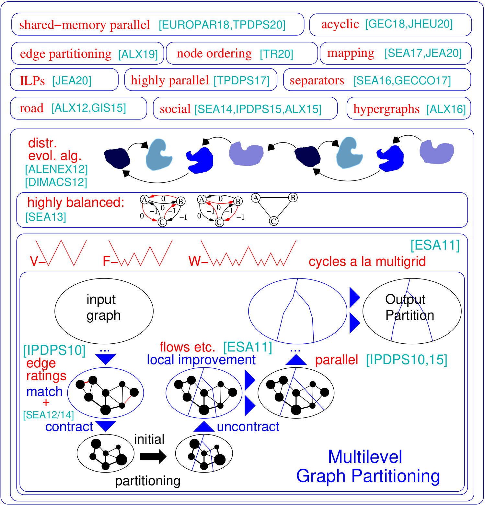

KaHIP v2.10  [](https://app.codacy.com/manual/schulzchristian/KaHIP?utm_source=github.com&utm_medium=referral&utm_content=schulzchristian/KaHIP&utm_campaign=Badge_Grade_Dashboard)
[](https://travis-ci.org/schulzchristian/KaHIP) 
[](https://opensource.org/licenses/MIT)
[](https://app.fossa.com/projects/git%2Bgithub.com%2Fschulzchristian%2FKaHIP?ref=badge_shield)
=====

The graph partitioning framework KaHIP -- Karlsruhe High Quality Partitioning.

The graph partitioning problem asks for a division of a graph's node set into k equally sized blocks such that the number of edges that run between the blocks is minimized. KaHIP is a family of graph partitioning programs. It includes KaFFPa (Karlsruhe Fast Flow Partitioner), which is a multilevel graph partitioning algorithm, in its variants Strong, Eco and Fast, KaFFPaE (KaFFPaEvolutionary) which is a parallel evolutionary algorithm that uses KaFFPa to provide combine and mutation operations, as well as KaBaPE which extends the evolutionary algorithm. Moreover, specialized techniques are included to partition road networks (Buffoon), to output a vertex separator from a given partition as well as techniques geared towards the efficient partitioning of social networks. Here is an overview of our framework:

<p align="center">

</p>


## NEW in v2.20: 
*TCMalloc:* possibility to link against TCMalloc

*Faster IO* for kaffpa (option --mmap_io)

## NEW in v2.10: 
*ParHIP (Parallel High Quality Partitioning):* Our distributed memory parallel partitioning techniques designed to partition hierarchically structured networks such as web graphs or social networks.

*Mapping Algorithms:* Our new algorithms to map the blocks onto processors to minimize overall communication time based on hierarchical partitionings of the task graph and fast local search algorithms.

*Edge Partitioning Algorithms:* Our new algorithms to compute edge partitionings of graphs. 


## Main project site:
https://kahip.github.io

Installation Notes
=====
## Downloading KaHIP: 
You can download KaHIP with the following command line:

```console
git clone https://github.com/KaHIP/KaHIP
```

## Compiling KaHIP: 
Before you can start you need to install the following software packages:

- if you want to use parallel algorithms contained withing the framework (e.g. ParHIP) you need OpenMPI (https://www.open-mpi.org/). 

Once you installed the packages, just type 
```console
./compile_withcmake.sh. 
```
In this case, all binaries, libraries and headers are in the folder ./deploy/ 

Alternatively use the standard cmake build process:
```console 
mkdir build
cd build 
cmake ../ -DCMAKE_BUILD_TYPE=Release     
make 
cd ..
```
In this case, the binaries, libraries and headers are in the folder ./build as well as ./build/parallel/parallel_src/

We also provide the option to link against TCMalloc. If you have it installed, run cmake with the additional option -DUSE_TCMALLOC=On.


Running Programs
=====

For a description of the graph format (and an extensive description of all other programs) please have a look into the manual. We give a short examples here.

## Overview of Programs and Usecase

### Default Partitioning Problem (sequentially) kaffpa, kaffpaE 
| Use Case | Programs |
| ------------ | -------- |
| Checking Graph Format | graph_checker  |
| Evaluate Partitioning Metrics | evaluator |
| Fast Sequential Partitioning, Meshes | kaffpa with preconfiguration set to fast  |
| Good Sequential Partitioning, Meshes | kaffpa with preconfiguration set to eco  |
| Very Good Sequential Partitioning, Meshes | kaffpa with preconfiguration set to strong |
| Fast Sequential Partitioning, Social | kaffpa with preconfiguration set to fsocial  |
| Good Sequential Partitioning, Social  | kaffpa with preconfiguration set to esocial  |
| Very Good Sequential Partitioning, Social | kaffpa with preconfiguration set to ssocial |
| ------------ | -------- |
| Highest Quality, Mesh | kaffpaE, use mpirun, large time limit  |
| Highest Quality, Social | kaffpaE, use mpirun, large time limit, preconfiguration ssocial  |
| Even Higher Quality | kaffpaE, use mpirun, large time limit, use the options --mh_enable_tabu_search, --mh_enable_kabapE  |
| ------------ | -------- |
| Mapping to Processor Networks | use enable_mapping option |
| ------------ | -------- |
| Parallel Partitioning | parhip, graph2binary, graph2binary_external, toolbox |
| Distributed Memory Parallel, Mesh | parhip with preconfigs ecomesh, fastmesh, ultrafastmesh |
| Distributed Memory Parallel, Social | parhip with preconfigs ecosocial, fastsocial, ultrafastsocial |
| Convert Metis to Binary | graph2binary, graph2binary_external |
| Evaluate and Convert Partitions | toolbox |
| ------------ | -------- |
| Node Separators | partition_to_vertex_separator, node_separator |
| Two Way Node Separators | node_separator |
| KWay Node Separators | use kaffpa to create k-partition, then partition_to_vertex_separator to create a separaotr |
| ------------ | -------- |
| Edge Partitioning | edge_partitioning, distributed_edge_partitioning |


Licence
=====
The program is licenced under MIT licence.
If you publish results using our algorithms, please acknowledge our work by quoting the following paper:

```
@inproceedings{sandersschulz2013,
             AUTHOR = {Sanders, Peter and Schulz, Christian},
             TITLE = {{Think Locally, Act Globally: Highly Balanced Graph Partitioning}},
             BOOKTITLE = {Proceedings of the 12th International Symposium on Experimental Algorithms (SEA'13)},
             SERIES = {LNCS},
             PUBLISHER = {Springer},
             YEAR = {2013},
             VOLUME = {7933},
             PAGES = {164--175}
}
```

If you use our parallel partitioner ParHIP please also cite the following paper:

```
@inproceedings{meyerhenkesandersschulz2017,
             AUTHOR = {Meyerhenke, Henning and Sanders, Peter and Schulz, Christian},
             TITLE = {{Parallel Graph Partitioning for Complex Networks}},
             JOURNAL = {IEEE Transactions on Parallel and Distributed Systems (TPDS)},
             VOLUME = {28},
             NUMBER = {9},
             PAGES = {2625--2638},
             YEAR = {2017}
}
```

If you use mapping algorithm please also cite the following paper:

```
@inproceedings{schulztraeff2017,
             AUTHOR = {Schulz, Christian and Träff, Jesper Larsson},
             TITLE = {{Better Process Mapping and Sparse Quadratic Assignment}},
             BOOKTITLE = {Proceedings of the 16th International Symposium on Experimental Algorithms (SEA'17)},
             PUBLISHER = {Schloss Dagstuhl - Leibniz-Zentrum fuer Informatik},
             VOLUME = {75},
             SERIES = {LIPIcs},
             PAGES = {4:1--4:15},
             YEAR = {2017}
}
```

If you use edge partitioning algorithms please also cite the following paper:

```
@inproceedings{edgepartitioning2019,
             AUTHOR = {Schlag, Sebastian and Schulz, Christian and Seemaier, Daniel and Strash, Darren},
             TITLE = {{Scalable Edge Partitioning}},
             BOOKTITLE = {Proceedings of the 21th Workshop on Algorithm Engineering and Experimentation (ALENEX)},
             PUBLISHER = {SIAM},
             PAGES = {211--225},
             YEAR = {2019}
}
```

Project Contributors (sorted by last name)
=====
Yaroslav Akhremtsev

Roland Glantz
 
Dennis Luxen

Henning Meyerhenke

Ilya Safro

Peter Sanders

Sebastian Schlag

Christian Schulz (maintainer)

Daniel Seemaier

Darren Strash

Jesper Larsson Träff
